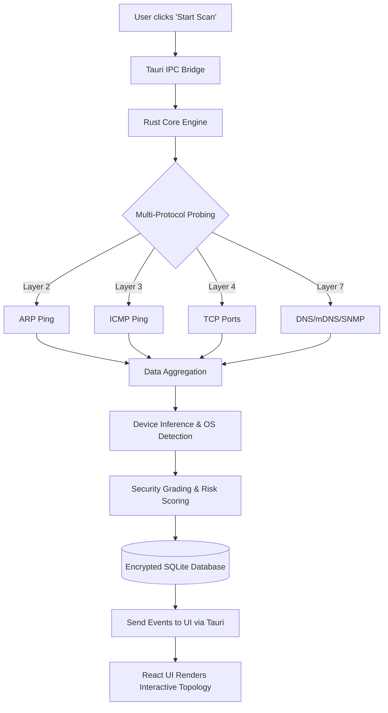

# NEXUS - Smart Network Topology Mapper & Health Monitor
*A Privacy-First Native Application for Network Intelligence, Security, and Monitoring.*

## 🎯 1. Aim (ရည်ရွယ်ချက်)
NEXUS ၏ အဓိက ရည်ရွယ်ချက်မှာ Network အတွင်းရှိ Device များကို လျင်မြန်စွာ ရှာဖွေပေးနိုင်ပြီး၊ ၎င်းတို့၏ ချိတ်ဆက်မှုများကို Interactive Topology Graph များဖြင့် ဖော်ပြပေးနိုင်ရန်၊ ယင်း Device များ၏ Security အခြေအနေကို အကဲဖြတ်ပေးနိုင်ရန်နှင့် 24/7 စောင့်ကြည့်ပေးနိုင်ရန်အတွက် ပြီးပြည့်စုံသော (All-in-one) Desktop Application တစ်ခု ဖန်တီးရန်ဖြစ်သည်။ 

## 🎯 2. Objectives (ဦးတည်ချက်များ)
- **Fast & Deep Discovery:** ARP, ICMP, TCP, SNMP နှင့် mDNS Protocol များကို တပြိုင်နက်တည်း အသုံးပြု၍ Network အတွင်းရှိ Device များကို စက္ကန့်ပိုင်းအတွင်း ရှာဖွေဖော်ထုတ်ရန်။
- **Visual Intelligence:** ခက်ခဲရှုပ်ထွေးသော Network ချိတ်ဆက်မှုများကို ရှင်းလင်းလွယ်ကူသော Interactive Network Topology မြေပုံအဖြစ် ပြောင်းလဲပြသရန်။
- **Proactive Security:** Device တစ်ခုချင်းစီ၏ Open Ports များနှင့် Vulnerabilities များကို စစ်ဆေးပြီး Security Grade (A-F) သတ်မှတ်ပေးရန်။
- **Continuous Monitoring:** Network အတွင်းသို့ Device အသစ်ဝင်လာခြင်း၊ ထွက်သွားခြင်း နှင့် IP ပြောင်းလဲမှုများကို အချိန်နဲ့တစ်ပြေးညီ 24/7 စောင့်ကြည့် (Monitor) လုပ်ရန်။
- **Privacy & Native Performance:** Cloud ပေါ်သို့ Data တင်စရာမလိုဘဲ အသုံးပြုသူ၏ စက်ပေါ်တွင်သာ AES-256-GCM Encryption ဖြင့် လုံခြုံစွာ သိမ်းဆည်းရန်နှင့် Rust ၏ အမြန်နှုန်းကို အသုံးပြုရန်။

## ⚠️ 3. Problem Statement (လက်ရှိကြုံတွေ့နေရသော ပြဿနာများ)
- **Complex Network Visibility:** Network Administrator များနှင့် Security Analyst များအတွက် မိမိတို့ Network အတွင်း မည်သည့် Device များ ချိတ်ဆက်နေသည်ကို အပြည့်အစုံ သိရှိရန် ခက်ခဲခြင်း။
- **Scattered Tools:** Network Scan ဖတ်ရန် Tool တစ်ခု (eg. Nmap)၊ Monitoring လုပ်ရန် Tool တစ်ခု၊ Report ထုတ်ရန် Tool တစ်ခု စသဖြင့် Tools အများအပြားကို ခွဲခြားသုံးစွဲနေရခြင်းကြောင့် အချိန်ကုန် လူပန်းဖြစ်ရခြင်း။
- **Privacy Concerns:** Cloud-based သို့မဟုတ် SaaS Network Monitor များသည် မိမိတို့၏ Sensitive Network Data များကို External Server ပေါ်သို့ ပို့ဆောင်ရသောကြောင့် Data Privacy ကို စိုးရိမ်ရခြင်း။
- **Lack of Actionable Security Insights:** ရိုးရှင်းသော Scanner အများစုသည် IP နှင့် MAC Address ကိုသာ ပြသနိုင်ပြီး ၎င်း Device သည် လုံခြုံရေးအရ စိတ်ချရမှု ရှိ/မရှိ (Security Grade & Risk) ကို ရှင်းလင်းစွာ မပြသနိုင်ခြင်း။

## 🔭 4. Scopes (ပရောဂျက်၏ နယ်ပယ်)
NEXUS သည် အောက်ပါ နယ်ပယ်များအတွင်း အဓိက အလုပ်လုပ်ဆောင်မည်ဖြစ်သည်-
- **Local Area Network (LAN) Visibility:** Private Subnet များအတွင်းရှိ Devices အားလုံး (Routers, Switches, PCs, Servers, Mobile, IoT, Cameras) ကို ရှာဖွေခြင်း။
- **Cross-Platform Support:** Windows, macOS, နှင့် Linux OS များအားလုံးတွင် Native App အနေဖြင့် အသုံးပြုနိုင်ခြင်း။
- **Data Export & Reporting:** Scan ဖတ်ထားသော ရလဒ်များနှင့် အချက်အလက်များကို CSV, JSON နှင့် လုံခြုံသော PDF Reports များအဖြစ် ထုတ်ပေးခြင်း။
- *Out of Scope:* Wide Area Network (WAN) Scanning နှင့် Cloud Infrastructure တိုက်ရိုက် Management လုပ်ခြင်းများ မပါဝင်ပါ။

## 🏗️ 5. System Design (System Architecture)
NEXUS ကို Layer (၃) ခုဖြင့် ဖွဲ့စည်းထားပါသည်-

1. **Presentation Layer (Frontend):**
   - React 19, TypeScript, Vite
   - Tailwind CSS 4, Framer Motion, React Flow (Topology အတွက်)
2. **Bridge Layer (Middleware):**
   - Tauri v2 IPC (Inter-Process Communication) ကို အသုံးပြု၍ Frontend နှင့် Backend ကို ဆက်သွယ်ပေးထားသည်။
3. **Core Engine Layer (Backend):**
   - **Rust Library (nexus-core):** pnet (ARP), surge-ping (ICMP), tokio::net (TCP)
   - **Database:** Bundled SQLite (AES-gcm ဖြင့် Encrypt လုပ်ထားသည်)

## 🔄 6. FlowCharts

### 🌐 Data & System Execution Flow

## ✨ 7. Current Features (လက်ရှိ ပါဝင်သော လုပ်ဆောင်ချက်များ)
1. **Multi-Protocol Scanning:** ARP, ICMP, TCP, SNMP, mDNS များကို ပေါင်းစပ်၍ Network ကို အသေးစိတ် Scan ဖတ်ခြင်း။
2. **Interactive Network Topology:** Network တစ်ခုလုံးကို Drag, Zoom ပြုလုပ်၍ စူးစမ်းနိုင်သော Graph အနေဖြင့် ပြသပေးခြင်း။
3. **Security Grading:** Device တိုင်းအတွက် Open Ports များနှင့် ယိုယွင်းချက်များကို ထောက်လှမ်းပြီး A-F Security Risk Grade သတ်မှတ်ပေးခြင်း။
4. **24/7 Network Monitoring:** Background တွင် အလုပ်လုပ်နေပြီး Device အသစ်ဝင်ခြင်း/ထွက်ခြင်း များကို Real-time Alert ပေးခြင်း။
5. **Dashboard & Health Score:** Network တစ်ခုလုံး၏ ကျန်းမာရေး (Health Score)၊ တည်ငြိမ်မှုနှင့် လုံခြုံရေးအခြေအနေများကို Dashboard တွင် အလွယ်တကူ ကြည့်ရှုနိုင်ခြင်း။
6. **Built-in Network Tools:** App ထဲမှ မထွက်ဘဲ Ping, Port Scanner, MAC Lookup များကို တိုက်ရိုက် အသုံးပြုနိုင်ခြင်း။

---

# 🎙️ 10-Minute Presentation Script & Flow
*ဤ Section သည် (၁၀) မိနစ်စာ Talk Show / Presentation အတွက် စနစ်တကျ ပြင်ဆင်ထားသော Slide-by-slide ဇာတ်ညွှန်း ဖြစ်ပါသည်။*

### Slide 1: Title & Introduction (1 min)
- **Visual:** NEXUS Logo နှင့် "Smart Network Topology Mapper & Health Monitor" ဆိုသော ခေါင်းစဉ်။ App ၏ Dark Mode Dashboard ပုံကို နောက်ခံတွင် ထားပါ။
- **Talk:** "အားလုံးပဲ မင်္ဂလာပါ။ ဒီနေ့ ကျွန်တော် တင်ဆက်ပေးမယ့် Project ကတော့ 'NEXUS' လို့အမည်ရတဲ့ Smart Network Topology Mapper & Health Monitor ပါ။ အလွယ်ပြောရရင် ကိုယ့်ရဲ့ Network ထဲမှာ ဘာတွေဖြစ်ပျက်နေလဲ ဆိုတာကို အကုန်မြင်နိုင်၊ လုံခြုံရေး အကဲဖြတ်နိုင်ပြီး၊ အမြဲတမ်း စောင့်ကြည့်ပေးနိုင်တဲ့ All-in-one Desktop Application တစ်ခု ဖြစ်ပါတယ်။"

### Slide 2: The Problem (1.5 mins)
- **Visual:** ရှုပ်ထွေးနေသော Network ကြိုးများ၊ အခက်အခဲဖြစ်နေသော Admin ပုံ သို့မဟုတ် Bullet points (No Visibility, Scattered Tools, Privacy Issues)။
- **Talk:** "လက်ရှိ IT လောကနဲ့ ရုံးတွေက Network တွေမှာ ကြုံနေရတဲ့ ပြဿနာက ဘာလဲဆိုတော့ 'Blind Spots' တွေပါ။ ကိုယ့် Network ထဲကို ဘယ် Device တွေ ဝင်ချိတ်နေလဲ ဆိုတာ အပြည့်အစုံ သိဖို့ ခက်ပါတယ်။ Scan ဖတ်ဖို့ Nmap သုံးရ၊ Monitor လုပ်ဖို့ တခြား Tool တစ်ခုသုံးရနဲ့ Tool တွေက ပြန့်ကျဲနေပါတယ်။ နောက်ပြီး Cloud-based Tool တွေသုံးရင် ကိုယ့် Network အချက်အလက်တွေ အပြင်ရောက်သွားနိုင်တဲ့ Privacy စိုးရိမ်စရာတွေ ရှိပါတယ်။ ဒီပြဿနာတွေကို ဖြေရှင်းဖို့ လုပ်ဆောင်ခဲ့တာပါ။"

### Slide 3: The Solution - Meet NEXUS (1 min)
- **Visual:** NEXUS ၏ UI (Interactive Topology View) လှလှပပပြထားသော ပုံ။ "Privacy-First, Native Speed, All-In-One" ဆိုသော စာသားများ။
- **Talk:** "ဒါကြောင့် NEXUS ကို ဖန်တီးခဲ့ပါတယ်။ သူက Cloud ပေါ်ကို Data လုံးဝ မပို့တဲ့ Privacy-first Native App ပါ။ Rust Programming Language ရဲ့ အမြန်နှုန်းနဲ့ တည်ဆောက်ထားလို့ Scan ဖတ်တာ အရမ်းမြန်သလို၊ Network မြေပုံကိုလည်း Graphic လှလှလေးနဲ့ ရှင်းရှင်းလင်းလင်း မြင်ရမှာ ဖြစ်ပါတယ်။"

### Slide 4: Key Features (2 mins)
- **Visual:** Icon လေးများဖြင့် Features များကို ပြရန် (Multi-Protocol Scan, Topology, Security Grading, 24/7 Monitor)။
- **Talk:** "NEXUS ရဲ့ အဓိက Feature (၄) ခုကတော့..
  ၁. **Multi-Protocol Scanning:** ARP, ICMP, TCP တွေကို တပြိုင်နက်သုံးပြီး ကွန်ရက်တစ်ခုလုံးကို စက္ကန့်ပိုင်းအတွင်း Scan ဖတ်ပေးပါတယ်။
  ၂. **Interactive Topology:** ရလာတဲ့ ရလဒ်တွေကို စာတွေချည်းပဲ မဟုတ်ဘဲ Zoom လုပ်၊ ဆွဲရွှေ့ကြည့်လို့ရတဲ့ မြေပုံ (Topology) အနေနဲ့ ပြပေးပါတယ်။
  ၃. **Security Grading:** တွေ့တဲ့ Device တိုင်းဟာ လုံခြုံမှုရှိလား၊ Open Ports တွေ ဘာတွေရှိလဲဆိုတာ စစ်ဆေးပြီး A ကနေ F အထိ အမှတ်ပေးပါတယ်။
  ၄. **24/7 Monitoring:** ကွန်ရက်ထဲကို Device အသစ်ဝင်လာတာနဲ့ ချက်ချင်း Alert ပေးလို့ အချိန်မရွေး စိတ်ချရပါတယ်။"

### Slide 5: System Architecture & Tech Stack (1.5 mins)
- **Visual:** ရှေ့တွင်ရေးထားသော Architecture Diagram သို့မဟုတ် React + Tauri + Rust Logo များ။
- **Talk:** "Technical ပိုင်းအရ ပြောရရင် NEXUS ကို Layer ၃ ခုနဲ့ ဖွဲ့စည်းထားပါတယ်။ Frontend ကို React 19 နဲ့ ရေးထားပြီး၊ Backend (Core Engine) ကိုတော့ Performance အရမ်းကောင်းတဲ့ Rust ကို အသုံးပြုထားပါတယ်။ ပြီးတော့ ဒီနှစ်ခုကို ဆက်သွယ်ပေးဖို့ Tauri v2 ကို သုံးထားတဲ့အတွက် Mac, Windows, Linux အကုန်လုံးမှာ Native App အဖြစ် အသုံးပြုနိုင်ပါတယ်။ Database အနေနဲ့ SQLite ကို သုံးထားပြီး Data တွေကို AES-256 နဲ့ Encrypt လုပ်ထားလို့ လုံခြုံရေးအတွက် လုံးဝ စိတ်ချရပါတယ်။"

### Slide 6: Demo or Workflow (2 mins)
- **Visual:** အက်ပ်၏ Dashboard ကို Scan စလုပ်သည့်ပုံ၊ Result ထွက်လာပြီး Device Detail ကြည့်သည့်ပုံ (Screenshots ၃ ပုံခန့် တွဲလျက်) သို့မဟုတ် Video အတို။
- **Talk:** "အသုံးပြုပုံက အရမ်းကို ရိုးရှင်းပါတယ်။ App ကိုဖွင့် 'Start Scan' ကို နှိပ်လိုက်တာနဲ့... စက္ကန့်ပိုင်းအတွင်းမှာ ရှိသမျှ Device တွေကို သူ့အမျိုးအစားနဲ့သူ (Router, PC, Phone, IoT) ခွဲခြားပြီး ပြပေးပါတယ်။ သက်ဆိုင်ရာ Device ကိုနှိပ်လိုက်ရင် IP, MAC Address, OS, နဲ့ Vulnerability အခြေအနေ (Security Grade) အကုန်လုံးကို တစ်နေရာတည်းမှာ အသေးစိတ် တွေ့ရမှာပါ။ Report လိုချင်ရင်လည်း PDF ထုတ်လို့ ရနေပါပြီ။"

### Slide 7: Future Scopes & Conclusion (1 min)
- **Visual:** Road map (AI Integration, Enterprise Dashboard) နှင့် "Thank You / Q&A" စာသား။
- **Talk:** "အနာဂတ်မှာဆိုရင်တော့ AI Integration (Local Ollama အသုံးပြုပြီး Network log တွေကို မေးမြန်းနိုင်မယ့်) Feature တွေ ထပ်ထည့်ဖို့ စဉ်းစားထားပါတယ်။ အချုပ်အနေနဲ့ ပြောရရင် NEXUS ဟာ ပုံမှန် Admin တွေအတွက်ရော၊ Security ပိုင်း စိတ်ဝင်စားသူတွေအတွက်ပါ မရှိမဖြစ် ဆောင်ထားသင့်တဲ့ Tool တစ်ခုပါ။ အခုချိန်ပေးပြီး နားထောင်ပေးတဲ့အတွက် ကျေးဇူးတင်ပါတယ်။ သိလိုတာများ မေးမြန်းနိုင်ပါတယ်။"

---

# 🇬🇧 English Version

## 🎯 1. Aim
The main aim of NEXUS is to create an all-in-one desktop application capable of rapidly discovering devices within a network, visualizing their connections through interactive topology graphs, assessing the security posture of these devices, and providing continuous 24/7 monitoring.

## 🎯 2. Objectives
- **Fast & Deep Discovery:** Automatically discover all devices in the network within seconds using multiple protocols simultaneously (ARP, ICMP, TCP, SNMP, and mDNS).
- **Visual Intelligence:** Transform complex network connections into a clear, interactive network topology map.
- **Proactive Security:** Scan open ports and detect vulnerabilities for each device to assign a Security Grade (A-F).
- **Continuous Monitoring:** Monitor the network 24/7 in real-time to alert users of new devices joining, leaving, or IP changes.
- **Privacy & Native Performance:** Ensure absolute data privacy by storing data locally via AES-256-GCM encrypted SQLite without pushing anything to the cloud, taking full advantage of Rust's native performance.

## ⚠️ 3. Problem Statement
- **Complex Network Visibility:** Network Administrators and Security Analysts often find it difficult to gain complete visibility into exactly which devices are connected to their networks.
- **Scattered Tools:** Using separate tools for scanning (e.g., Nmap), monitoring, and reporting is time-consuming and inefficient.
- **Privacy Concerns:** Cloud-based or SaaS network monitoring solutions raise privacy concerns since sensitive network data must be routed through external servers.
- **Lack of Actionable Security Insights:** Most simple scanners only display IPs and MAC addresses without providing a clear indication of a device's security risk or health status.

## 🔭 4. Scopes
NEXUS primarily operates within the following scopes:
- **Local Area Network (LAN) Visibility:** Discovering all devices (Routers, Switches, PCs, Servers, Mobile, IoT, Cameras) within private subnets.
- **Cross-Platform Support:** Functioning as a native application across Windows, macOS, and Linux OS.
- **Data Export & Reporting:** Exporting scan results and data into CSV, JSON, and secure PDF formats.
- *Out of Scope:* Scanning Wide Area Networks (WAN) and managing/provisioning cloud infrastructure.

## 🏗️ 5. System Design (Architecture)
NEXUS is built on a 3-layer architecture:

1. **Presentation Layer (Frontend):**
   - React 19, TypeScript, Vite
   - Tailwind CSS 4, Framer Motion, React Flow (for Topology)
2. **Bridge Layer (Middleware):**
   - Tauri v2 IPC (Inter-Process Communication) to connect the Frontend and Backend.
3. **Core Engine Layer (Backend):**
   - **Rust Library (nexus-core):** pnet (ARP), surge-ping (ICMP), tokio::net (TCP)
   - **Database:** Bundled SQLite (Encrypted via AES-gcm)

## 🔄 6. FlowCharts

### 🌐 Data & System Execution Flow

## ✨ 7. Current Features
1. **Multi-Protocol Scanning:** Comprehensive network discovery combining ARP, ICMP, TCP, SNMP, and mDNS.
2. **Interactive Network Topology:** Explore the entire network map by dragging, zooming, and interacting with device nodes.
3. **Security Grading:** Evaluate Open Ports and vulnerabilities to assign an A-F Security Risk Grade to each device.
4. **24/7 Network Monitoring:** Real-time background monitoring and alerts for devices joining/leaving the network.
5. **Dashboard & Health Score:** A unified dashboard displaying the overall network health score, stability, and security status.
6. **Built-in Network Tools:** Run Ping, Port Scanner, and MAC Lookups directly within the app without switching tools.

---

# 🎙️ 10-Minute Presentation Script & Flow (English)
*This section is a slide-by-slide script meticulously prepared for a 10-minute professional presentation or talk show.*

### Slide 1: Title & Introduction (1 min)
- **Visual:** NEXUS Logo with the title "Smart Network Topology Mapper & Health Monitor". Dark Mode Dashboard as the background.
- **Talk:** "Hello everyone! Today, I am excited to present my project, 'NEXUS' - a Smart Network Topology Mapper & Health Monitor. Put simply, it’s an all-in-one desktop application that gives you total visibility into your network, evaluates security, and continuously monitors all activities."

### Slide 2: The Problem (1.5 mins)
- **Visual:** Tangled network cables or a frustrated admin, alongside bullet points (No Visibility, Scattered Tools, Privacy Issues).
- **Talk:** "The major issue plaguing IT and corporate networks today is 'Blind Spots'. It's extremely difficult to know exactly what devices are connected to your network. You have to use Nmap for scanning, another tool for monitoring, which results in scattered, inefficient workflows. Furthermore, utilizing cloud-based tools requires sending your sensitive network data outside your perimeter, raising huge privacy concerns."

### Slide 3: The Solution - Meet NEXUS (1 min)
- **Visual:** Beautifully crafted Interactive Topology View of NEXUS. Highlight texts: "Privacy-First, Native Speed, All-In-One".
- **Talk:** "That's why I created NEXUS. It's a completely privacy-first native application—zero data is sent to the cloud. Because it's powered by Rust, the scanning engine is blazingly fast, and it visualizes the entire network into a beautifully rendered, easy-to-understand topology graph."

### Slide 4: Key Features (2 mins)
- **Visual:** Icons paired with key features (Multi-Protocol Scan, Topology, Security Grading, 24/7 Monitor).
- **Talk:** "NEXUS has four core features:
  1. **Multi-Protocol Scanning:** Using ARP, ICMP, and TCP simultaneously, it scans your entire subnet in mere seconds.
  2. **Interactive Topology:** The scan results aren't just lists of text; they are plotted onto an interactive, zoomable network map.
  3. **Security Grading:** Every device is audited for open ports and vulnerabilities, then graded from A to F based on its security risk.
  4. **24/7 Monitoring:** The app sends real-time alerts the moment a new device joins or an existing one drops off the network."

### Slide 5: System Architecture & Tech Stack (1.5 mins)
- **Visual:** The Architecture Diagram from the previous section or logos of React, Tauri, and Rust.
- **Talk:** "From a technical perspective, NEXUS uses a 3-layer architecture. The Frontend is built with React 19, while the Backend—our core engine—is entirely written in Rust for peak performance. Connecting the two is Tauri v2, allowing NEXUS to run as a cross-platform native app on Mac, Windows, and Linux. Data is securely stored using SQLite and encrypted locally with AES-256."

### Slide 6: Demo or Workflow (2 mins)
- **Visual:** 3 paired screenshots: Starting a scan on the Dashboard, Viewing Results, and Device Detail Modal (or a short video).
- **Talk:** "Using NEXUS is incredibly simple. Just open the app and click 'Start Scan'. Within seconds, it discovers all devices, classifying them automatically—Routers, PCs, Phones, IoT. Clicking on any device unlocks full details like IP, MAC Address, guessed OS, and its Security Grade. And if you need to report to management, customized PDF reports are just a click away."

### Slide 7: Future Scopes & Conclusion (1 min)
- **Visual:** Roadmap (AI Integration, Enterprise Dashboard) with "Thank You / Q&A" text.
- **Talk:** "Looking ahead, we are exploring AI integration using local LLMs like Ollama to allow users to securely query their network logs using natural language. To conclude, NEXUS is an essential tool not just for sysadmins but for anyone serious about local network security. Thank you for your time, and I am happy to take any questions."
